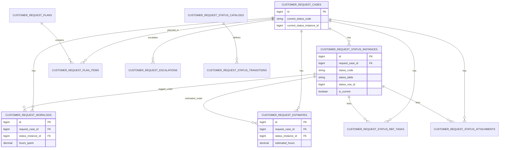

# Báo cáo bảng dữ liệu & luồng nghiệp vụ
## Module: Quản lý yêu cầu khách hàng (CRC)

Ngày lập: 2026-04-06

## 1) Danh sách bảng DB đang dùng trong chức năng CRC

> Phạm vi: các bảng active thuộc nhóm `customer_request_*` + bảng master CRC.  
> Ghi chú: có một số bảng legacy còn tồn tại vật lý để tương thích dữ liệu cũ (đã nêu rõ ở cột ghi chú).

| STT | Tên table | Số trường | Ghi chú bảng dùng để làm gì |
|---:|---|---:|---|
| 1 | `customer_request_cases` | 38 | Bảng master của 1 yêu cầu: thông tin tiếp nhận, owner (C/D/P), trạng thái hiện tại, giờ estimate/thực tế, mốc thời gian chính. |
| 2 | `customer_request_status_instances` | 17 | Nhật ký immutable theo từng lần vào trạng thái; lưu chuỗi previous/next, cờ `is_current`, metadata decision PM. |
| 3 | `customer_request_status_catalogs` | 8 | Danh mục trạng thái (status code, label, table backing). |
| 4 | `customer_request_status_transitions` | 10 | Danh mục các chuyển trạng thái hợp lệ (from -> to), hướng tiến/lùi, thứ tự ưu tiên. |
| 5 | `customer_request_worklogs` | 18 | Nhật ký giờ công xử lý theo yêu cầu/trạng thái; phục vụ timesheet, cảnh báo overrun, báo cáo. |
| 6 | `customer_request_estimates` | 15 | Lịch sử estimate theo thời điểm/trạng thái/người cập nhật; không ghi đè lịch sử. |
| 7 | `customer_request_status_ref_tasks` | 8 | Bảng nối trạng thái <-> task tham chiếu (`request_ref_tasks`). |
| 8 | `customer_request_status_attachments` | 8 | Bảng nối trạng thái <-> file đính kèm (`attachments`). |
| 9 | `customer_request_waiting_customer_feedbacks` | 13 | Payload chi tiết khi trạng thái “Đợi phản hồi KH”. |
| 10 | `customer_request_in_progress` | 13 | Payload chi tiết khi trạng thái “Đang xử lý”. |
| 11 | `customer_request_analysis` | 11 | Payload chi tiết khi trạng thái “Phân tích”. |
| 12 | `customer_request_not_executed` | 11 | Payload chi tiết khi trạng thái “Không thực hiện”. |
| 13 | `customer_request_completed` | 11 | Payload chi tiết khi trạng thái “Hoàn thành”. |
| 14 | `customer_request_customer_notified` | 13 | Payload chi tiết khi trạng thái “Báo khách hàng”. |
| 15 | `customer_request_returned_to_manager` | 11 | Payload chi tiết khi trạng thái “Chuyển trả người quản lý”. |
| 16 | `customer_request_coding` | 16* | Payload chi tiết nhánh “Đang lập trình” (sub-phase coding/upcode). |
| 17 | `customer_request_dms_transfer` | 15 | Payload chi tiết nhánh “Chuyển DMS” (sub-phase exchange/task/in-progress/completed). |
| 18 | `customer_request_plans` | 14 | Header kế hoạch tuần/tháng cho CRC (điều phối nguồn lực). |
| 19 | `customer_request_plan_items` | 16 | Dòng kế hoạch theo case/performer/hours trong một plan. |
| 20 | `customer_request_escalations` | 23 | Quản lý escalation: mức độ, người duyệt, quyết định xử lý, vòng đời escalation/directive. |
| 21 | `customer_request_pending_dispatch` | 10 | Bảng legacy V4 “chờ điều phối”; giữ lại tương thích dữ liệu cũ, case mới XML có thể ẩn ở UI. |
| 22 | `customer_request_dispatched` | 12 | Bảng legacy V4 “đã điều phối”; giữ lại tương thích dữ liệu cũ, case mới XML có thể ẩn ở UI. |

\* `customer_request_coding`: có khả năng chênh 15/16 field tùy lịch sử migration đã chạy; model hiện tại kỳ vọng có `upcode_at`.

---

## 2) Sơ đồ luồng dữ liệu chức năng CRC

```mermaid
flowchart TD
    A[Tạo yêu cầu mới] --> B[INSERT customer_request_cases\ncurrent_status_code = new_intake]
    B --> C[INSERT customer_request_status_instances\ninstance đầu tiên]
    C --> D[INSERT status payload row\n(customer_request_cases hoặc bảng status tương ứng)]

    D --> E{Có thao tác chuyển trạng thái?}
    E -->|Có| F[Validate theo customer_request_status_transitions]
    F --> G[INSERT status_instance mới]
    G --> H[INSERT/UPDATE payload bảng trạng thái đích]
    H --> I[UPDATE customer_request_cases\ncurrent_status_code/current_status_instance_id]

    I --> J[Người xử lý ghi worklog\nINSERT customer_request_worklogs]
    I --> K[Cập nhật estimate\nINSERT customer_request_estimates]

    J --> L[Đồng bộ KPI/hours_usage/warn flags trên case]
    K --> L

    L --> M{Đến completed/customer_notified?}
    M -->|Yes| N[Khép vòng xử lý + theo dõi sau thông báo]
    M -->|No| E
```

---

## 3) Sơ đồ relationship giữa các bảng chính



---

## 4) Ghi chú triển khai quan trọng

- `customer_request_cases.current_status_instance_id` là con trỏ trạng thái hiện tại (quan hệ logic quan trọng nhất để đọc nhanh current state).
- `customer_request_status_instances` + `status_table/status_row_id` tạo mô hình “master + payload table theo status”, giúp mỗi trạng thái có schema riêng.
- `pending_dispatch` và `dispatched` là legacy implementation status: vẫn có bảng để tương thích dữ liệu cũ, nhưng UI XML mới có cơ chế ẩn/alias.
- Dòng dữ liệu giờ công & estimate luôn nên xem ở cả bảng lịch sử (`worklogs`, `estimates`) và trường denormalized trên `customer_request_cases`.

---

## 5) Bảng kế hoạch điều chỉnh **module hiện tại** `/customer-request-management`

> Phạm vi: điều chỉnh trực tiếp CRC hiện có (không làm module mới).
> Mục tiêu: (1) áp dụng workflow từ `workflowa.xlsx` vào luồng chạy thật; (2) chuẩn hóa màn hình status/transition chỉ còn 5 trường dùng chung: `received_at`, `completed_at`, `extended_at`, `notes`, `progress_percent`.

| Giai đoạn | Hạng mục | Việc cần làm trên hệ thống hiện tại | Deliverable |
|---|---|---|---|
| 1 | Chốt mapping workflowa -> status code hiện tại | Tạo bảng mapping từ nhãn trong Excel (vd: “Giao PM/Trả YC cho PM”, “R Đang thực hiện”, “Dev tạm ngưng”...) sang `customer_request_status_catalogs.status_code`; đồng thời map actor `A/R/Tất cả` sang rule permission transition | Bảng mapping chuẩn + danh sách transition hợp lệ import được |
| 2 | Nạp transition cho module hiện tại | Cập nhật seed/data cho `customer_request_status_transitions` theo workflowa (không phá trạng thái cũ đang dùng), gắn `actor_role`, `sort_order` rõ ràng | Dữ liệu transition mới cho môi trường dev/staging |
| 3 | Bật chọn workflow thật khi tạo yêu cầu | API create case nhận thêm `workflow_id`/`workflow_code`; frontend create modal gửi field này thật sự (không chỉ hiển thị UI); backend resolve initial route theo workflow đã chọn thay vì luôn default | Tạo mới case đi đúng nhánh workflow đã chọn |
| 4 | Chuẩn hóa form status về 5 trường | Ở backend: normalize/read/write thống nhất 5 field cho mọi trạng thái. Ở frontend: thay render field động theo status bằng form chuẩn dùng chung cho detail + transition modal | Mọi trạng thái hiển thị cùng 1 bộ field |
| 5 | Tương thích dữ liệu cũ | Giữ đọc được dữ liệu từ các bảng payload cũ; bổ sung lớp adapter/fallback để case cũ không lỗi khi mở detail; chỉ dùng schema chuẩn cho dữ liệu mới hoặc khi update | Không vỡ case lịch sử khi rollout |
| 6 | Permission theo actor trong workflowa | Tại service transition, enforce actor rule: A/R/Tất cả; C/I chỉ xem (không mutate). Đồng bộ hiển thị nút FE theo quyền tương ứng | Rule quyền nhất quán FE/BE |
| 7 | Test regression luồng hiện tại | Viết test cho 3 nhóm: create theo workflow, transition theo actor, và render 5 field; chạy regression với case cũ + case mới | Bộ test pass + checklist UAT |
| 8 | Rollout an toàn | Triển khai theo môi trường: dev -> staging -> prod; có script verify transition config sau deploy và kế hoạch rollback dữ liệu transition | Kế hoạch triển khai/rollback rõ ràng |

### 5.1 Danh sách 5 field chuẩn đề xuất (UI label)

| Field key | Nhãn hiển thị |
|---|---|
| `received_at` | Ngày bắt đầu |
| `completed_at` | Ngày kết thúc |
| `extended_at` | Ngày gia hạn |
| `notes` | Ghi chú |
| `progress_percent` | Tiến độ phần trăm |
